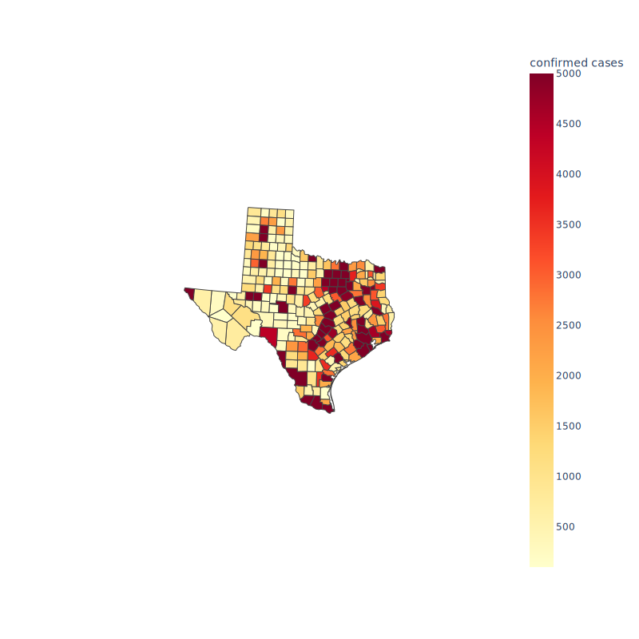

<head>
<meta charset="UTF-8">
<link rel="stylesheet" type="text/css" href="stmarkdown.css">
<script type="text/x-mathjax-config">
  MathJax.Hub.Config({tex2jax: {inlineMath: [['$','$'], ['\\(','\\)']]}});
</script>
<script type="text/javascript" async
  src="https://cdn.mathjax.org/mathjax/latest/MathJax.js?config=TeX-AMS_CHTML">
</script>
</head>

# Stata/Python intergration

Stata provides two ways for Python and Stata to interact, and we refer to these mechanisms collectively as PyStata.

## Use Python within Stata  - Stata 16

Python can be invoked from a running Stata session so that Python's extensive language features can be leveraged from within Stata. 

## Use Stata from Python  - Stata 17

Stata can be invoked from a standalone Python environment via the pystata Python package. It includes three IPython (interactive Python) magic commands and a suite of API functions for interacting with Stata.

* [Configure stata](https://www.stata.com/python/pystata/install.html#method-1-installing-via-pip)

* [Use Stata in Jupyter](https://www.stata.com/new-in-stata/jupyter-notebooks/)

* [Stata Python API](https://www.stata.com/python/api17/)

## Use Stata with Python/dash to generate dashboard

[An example](./src/dashboard.py)

## Use Stata to generate maps

* spmap (grmap)

```
use ./data/covid19_adj, replace
grmap, activate
drop if province_state == "Alaska" | province_state == "Hawaii"
spset, modify shpfile(usacounties_shp)
grmap confirmed_adj, clnumber(7)
```

<<dd_do: quietly>>
use ./data/covid19_adj, replace
grmap, activate
drop if province_state == "Alaska" | province_state == "Hawaii"
spset, modify shpfile(usacounties_shp)
grmap confirmed_adj, clnumber(7)
<</dd_do>>

<<dd_graph: saving(map_ex0.svg) replace>>


* maptile

```
sysuse census
rename (state state2) (statename state)
gen babyperc=poplt5/pop*100
maptile babyperc, geo(state)
```


<<dd_do: quietly>>
sysuse census, clear
rename (state state2) (statename state)
gen babyperc=poplt5/pop*100
maptile babyperc, geo(state)
<</dd_do>>

<<dd_graph: saving(map_ex1.svg) replace>>

* Use Python

<<dd_do:quietly>>
cd ./src
do covid19_py
cd ..
<</dd_do>>



